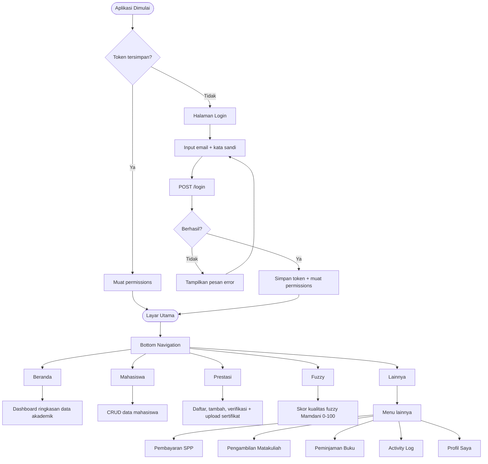

# Dokumentasi Aplikasi Mobile MyCampus

Dokumentasi aplikasi Android **MyCampus Mobile** yang dibangun dengan **Flutter**.

## Ringkasan

| Aspek | Detail |
|---|---|
| Framework | Flutter 3 (Material 3) |
| Bahasa | Dart |
| Arsitektur | Layar per fitur, service-based API |
| Backend | REST API Laravel 13 + Sanctum |
| Build | APK split-per-abi (arm64-v8a, armeabi-v7a, x86_64) |

## Struktur Proyek

```
lib/
├── main.dart                        # Entry point aplikasi
├── app_config.dart                  # Konfigurasi base URL server
├── theme/
│   └── app_theme.dart               # Tema Material 3 gelap neon
├── services/
│   ├── api_service.dart             # HTTP client (login, token, request)
│   └── js_challenge_solver.dart     # Solver JS Challenge InfinityFree
└── screens/
    ├── login_screen.dart            # Login dengan token Sanctum
    ├── home_screen.dart             # Dashboard utama
    ├── mahasiswa_screen.dart        # Data mahasiswa
    ├── prestasi_screen.dart         # Prestasi mahasiswa
    ├── kualitas_fuzzy_screen.dart   # Skor kualitas fuzzy
    ├── pembayaran_spp_screen.dart   # Pembayaran SPP
    ├── pengambilan_matakuliah_screen.dart # Pengambilan mata kuliah
    ├── peminjaman_buku_screen.dart  # Peminjaman buku
    ├── activity_log_screen.dart     # Log aktivitas (operator)
    ├── profile_screen.dart          # Profil user
    ├── server_config_screen.dart    # Konfigurasi server
    └── forms/                       # Form input tiap fitur
```

## Fitur

- Login dengan token **Sanctum** (Bearer token)
- Dashboard ringkasan data akademik
- CRUD data mahasiswa, pembayaran SPP, matakuliah, peminjaman buku
- Pendaftaran & verifikasi prestasi + upload sertifikat
- Skor kualitas **fuzzy** (Mamdani, 0–100) di layar Kualitas Fuzzy
- Activity log untuk peran operator
- Mode gelap Material 3 dengan aksen neon
- Solver **JS Challenge** untuk hosting InfinityFree

## Alur Aplikasi

Alur kerja aplikasi dimulai dari pengecekan token: jika token tersimpan, aplikasi langsung masuk ke layar utama; jika tidak, pengguna harus login lewat `POST /login`. Navigasi utama memakai **Bottom Navigation** dengan 5 tab.



> Catatan: menu **Activity Log**, **Pembayaran SPP**, **Pengambilan Matakuliah**, dan **Peminjaman Buku** hanya tampil pada layar *Lainnya* jika pengguna memiliki hak akses (permission) yang sesuai.

## API Service

- Base URL tersimpan di `app_config.dart` dan dapat diubah lewat layar *Server Config*.
- Semua request membutuhkan header `Authorization: Bearer <token>`.
- Tanggapan API berupa JSON; error ditampilkan lewat snackbar/dialog.

## Build APK

```bash
flutter build apk --split-per-abi
```

Hasil build berada di `build/app/outputs/flutter-apk/`:

| File | Target |
|---|---|
| `app-arm64-v8a-release.apk` | HP Android modern (disarankan) |
| `app-armeabi-v7a-release.apk` | HP lama 32-bit |
| `app-x86_64-release.apk` | Emulator / Intel |

> Unduh langsung dari bagian [Download](#download) halaman ini atau GitHub Releases `MYSHU29/mycampus-releases`.
